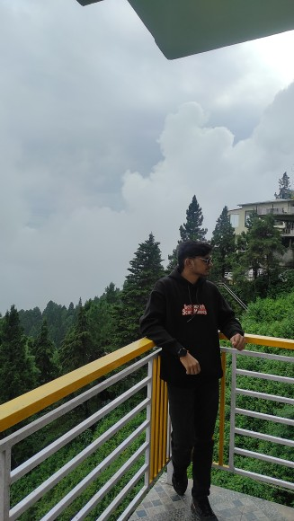

<!DOCTYPE html>
<html>
<head>
  <meta charset="UTF-8">
  <meta name="viewport" content="width=device-width, initial-scale=1.0">
  <title>My Portfolio</title>
</head>
<body>

  <h1>My Portfolio</h1>
  
  

  <h2 id="home">Home</h2>
  
<b>Name : </b>Vishwajeet Soni <b>Education : </b>First Year BCA Student at Bennett University.  Welcome to my portfolio website.

  
 
  
  

  <h2 id="about">About Me</h2>
  
I am a beginner learning web development.  I know the basics of HTML and python language.  I am working on improving my skills.

  

  <h2 id="contact">Contact Me</h2>
  
Email: <a href="mailto:sonivishwajeet45@gmail.com">sonivishwajeet45@gmail.com</a> 
   Phone: <a href="tel:+916269016436">+91-6269016436</a>

  

  <h3> Your visit means a lot to me. I look forward to connecting again soon.</h3>

</body>
</html>
